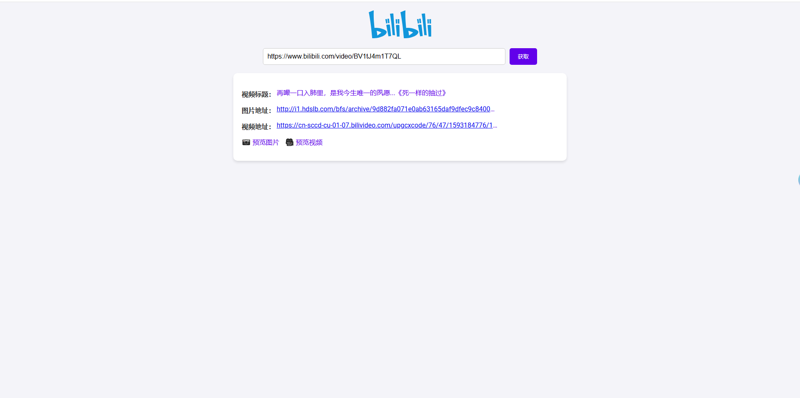

## 使用方法

### 脚本解析

文件`exp.py`，修改文件内`bv`号，解析b站视频地址

### docker部署 

使用docker跑一个简单的flask应用，源码在`src`目录下app.py作为后端，`templates/index.html`作为前端

编译docker镜像

```bash
docker build -t flask:bilidown .
```

启动容器

```bash
docker run -d -p 5000:5000 flask:bilidown bilidown
```


